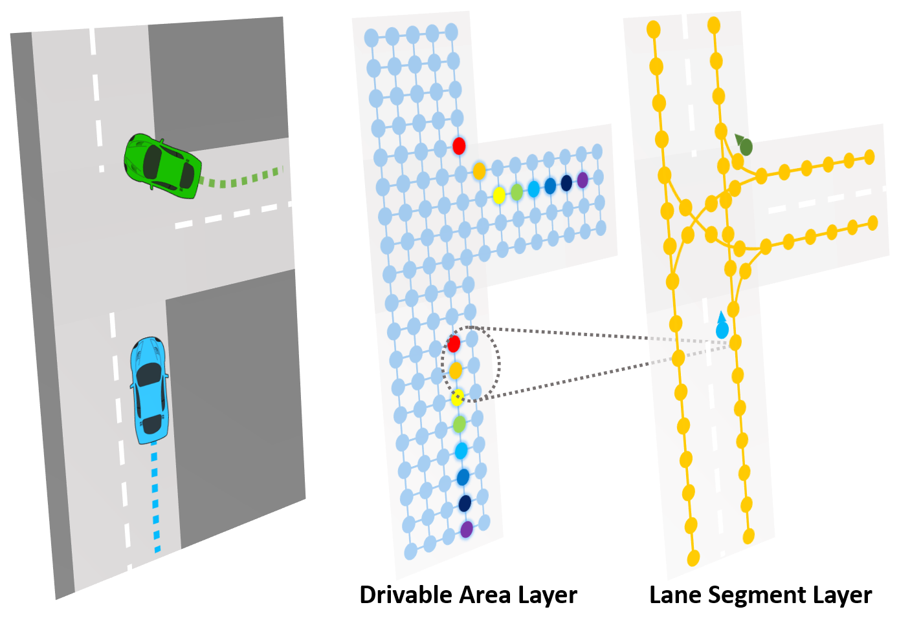
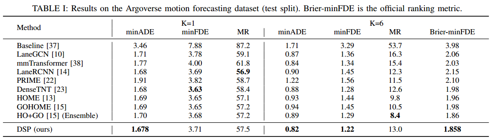
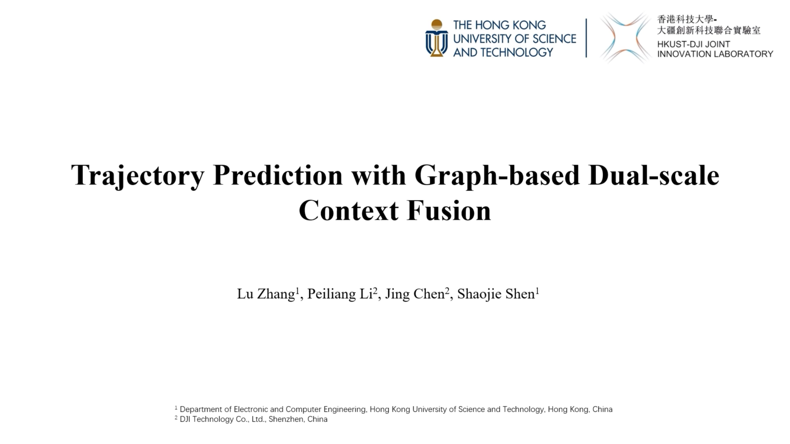
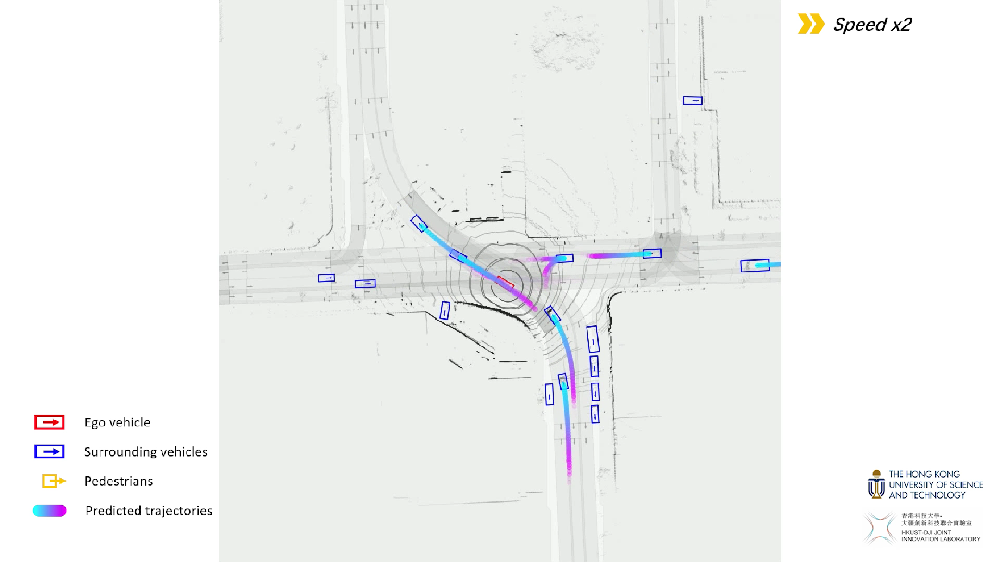
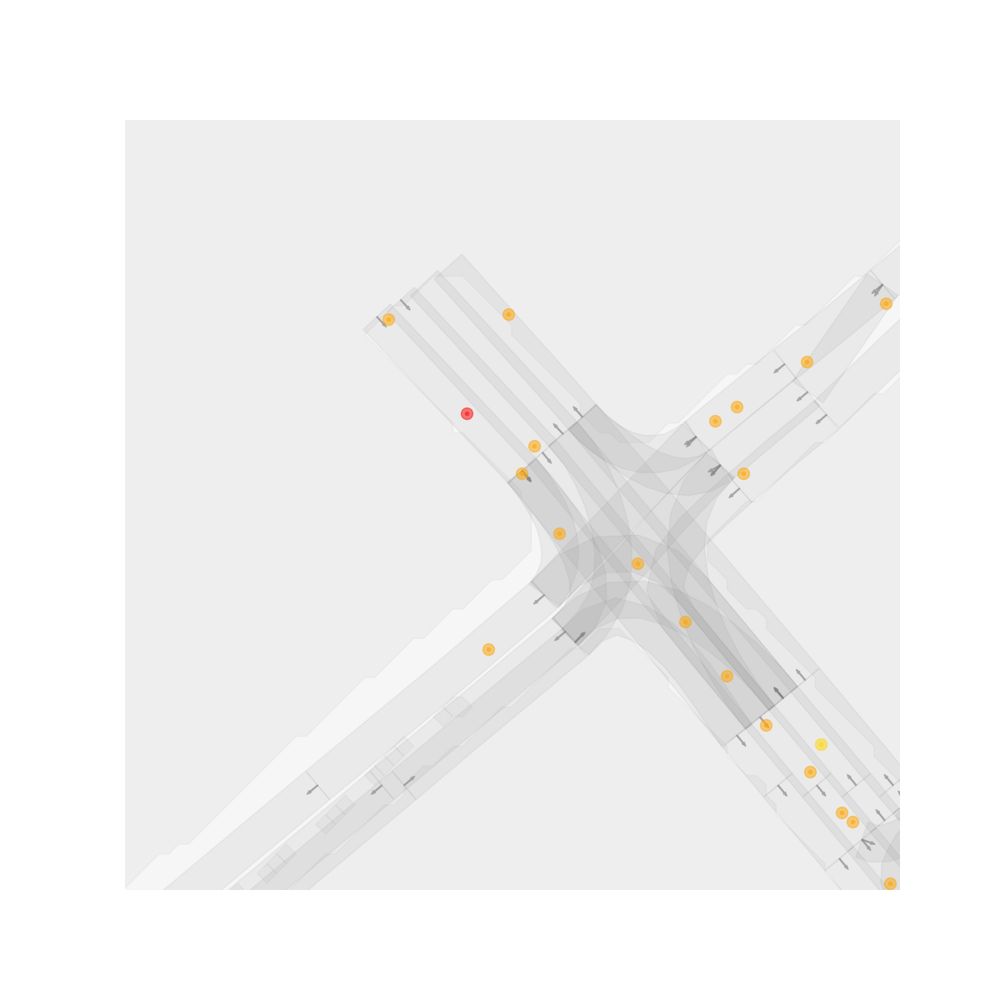
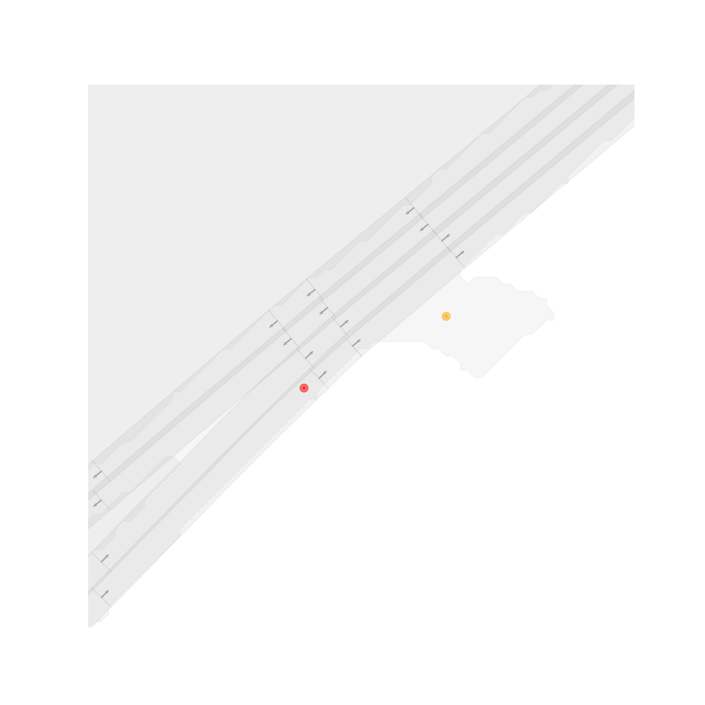
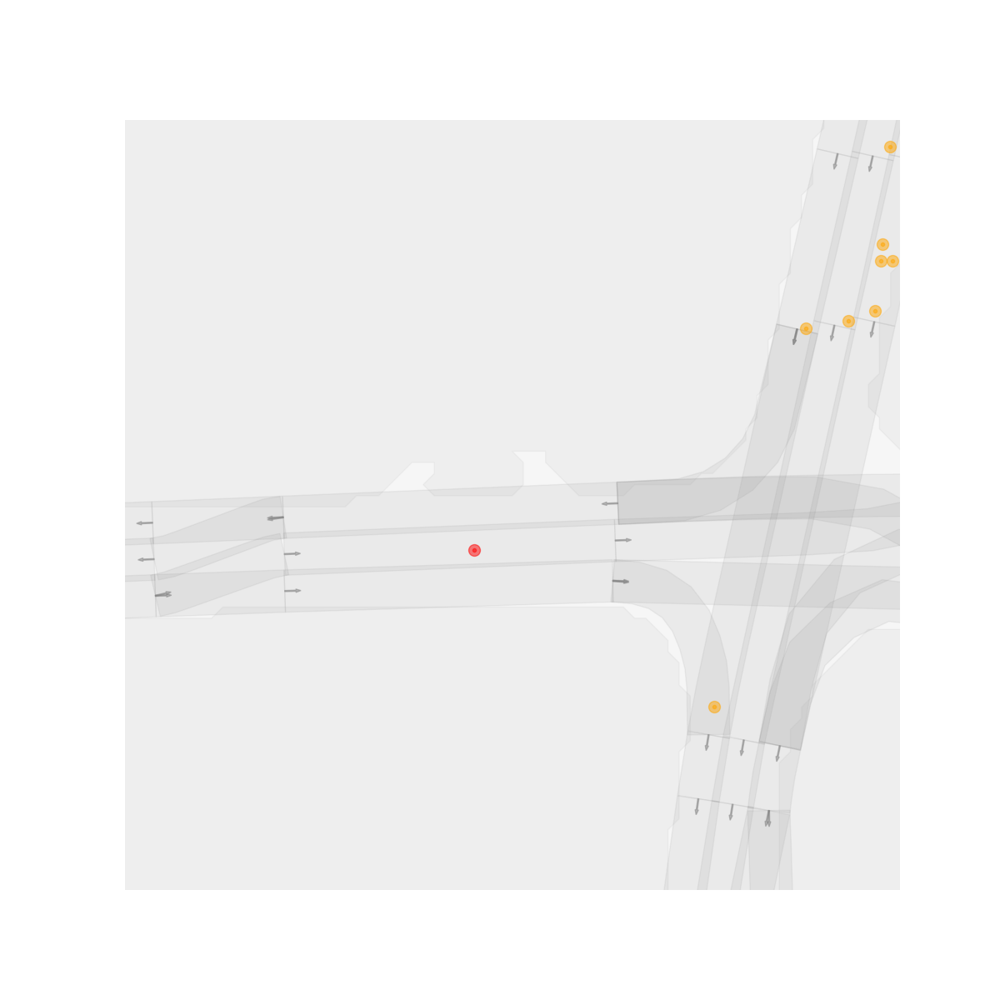

# Trajectory Prediction with Graph-based Dual-scale Context Fusion

## Introduction

(**NEW**) This paper is accepted for publication in the Proceedings of the *2022 IEEE/RSJ International Conference on Intelligent Robots and Systems (IROS 2022)*.

This is the project page of the paper 
```
Lu Zhang, Peiliang Li, Jing Chen and Shaojie Shen, "Trajectory Prediction with Graph-based Dual-scale Context Fusion", 2021.
```

**Preprint:** [Link](https://arxiv.org/abs/2111.01592)

<p align="center">
  
</p>

**Quantitative Results:**

<p align="center">
  
</p>

**Video:**
<a href="https://youtu.be/AifLEhVQXjo" target="_blank">
  <p align="center">
    
  </p>
</a>

**Supplementary Video (Argoverse Tracking dataset):**
<a href="https://youtu.be/Rjk2u9O59R4" target="_blank">
  <p align="center">
    
  </p>
</a>

## Demo
* Color scheme: green - predicted trajectories; red - observation & GT trajectories; orange - other agents.

<p align="center">
  
  
  
  
</p>

----

## Have a try!

### Install dependencies
- Create a new conda env
```
conda create --name dsp python=3.8
conda activate dsp
```

- Install PyTorch according to your CUDA version. For RTX 30 series, we recommend CUDA >= 11.1, PyTorch >= 1.8.0.
```
conda install pytorch==1.10.1 torchvision==0.11.2 torchaudio==0.10.1 cudatoolkit=11.3 -c pytorch -c conda-forge
```

- Install Argoverse API, please follow this [page](https://github.com/argoai/argoverse-api).

- Install other dependencies
```
pip install scikit-image IPython tqdm ipdb tensorboard
```

- Install PyTorch Scatter, please refer to this [page](https://github.com/rusty1s/pytorch_scatter).


### Play with pretrained models
Generate a subset of the dataset for testing using the script (it will generate 1k samples):
```
bash scripts/argo_preproc_small.sh
```
Download the pretrained model ([Google](https://drive.google.com/file/d/1Qi6mq1zXLpNfxg4slltN-2qJHIQ0szCP/view?usp=sharing)) ([Baidu](https://pan.baidu.com/s/1c-rj1n0WcE_v0_tWAhk2Pg), code: tmnz). Move the pretrained model to `./saved_models/`, then use the scripts below to get prediction results:
```
bash scripts/argo_dsp_vis.sh
```
Since we store each sequence as a single file, the system may raise error `OSError: [Erron 24] Too many open files` during evaluation and training. You may use the command below to solve this issue:
```
ulimit -SHn 51200
ulimit -s unlimited
```

### Train from scratch

- Preprocess Argoverse motion forecasting dataset using the script:
```
bash scripts/argo_preproc_all.sh
```
Note that the preprocessed dataset is pretty large (~ 90 GB), please reserve enough space for preprocessing.

- Launch (single-card) training using the script:
```
bash scripts/argo_dsp_train.sh
```

## Citation
If you find this paper useful for your research, please consider citing the following:
```
@article{zhang2021trajectory,
  title={Trajectory Prediction with Graph-based Dual-scale Context Fusion},
  author={Zhang, Lu and Li, Peiliang and Chen, Jing and Shen, Shaojie},
  journal={arXiv preprint arXiv:2111.01592},
  year={2021}
}
```

## Acknowledgement
We would like to express sincere thanks to the authors of the following tools and packages:
- [LaneGCN](https://github.com/uber-research/LaneGCN)
- [PyTorch Scatter](https://github.com/rusty1s/pytorch_scatter)